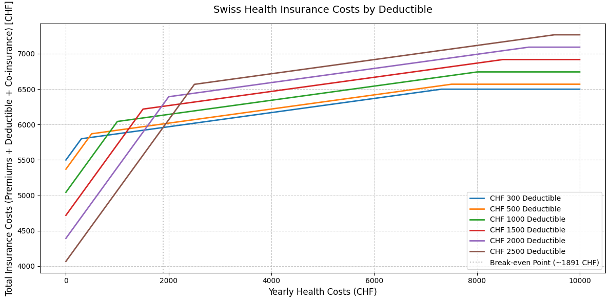

# Insurek – Swiss Health Insurance Deductible Optimizer

<p align="center">
  
</p>

## 💡 The Big Insight: Save Money by Choosing Smart

Switzerland’s health insurance system offers **six deductible options** (*franchises*), from CHF 300 to CHF 2,500. But which one actually saves you the most money?  
**The answer is surprisingly simple:**  
- If your **average yearly health expenses are below ~CHF 2,000**, choose the **CHF 2,500 deductible** (lowest premiums).
- If your **expenses are above ~CHF 2,000**, choose the **CHF 300 deductible** (lowest out-of-pocket costs).

The other four options? They’re almost always more expensive in total.  
This project crunches the numbers for you, so you can make the smartest, most cost-effective choice—instantly.

---

## 🚀 What Is Insurek?

**Insurek** is a multilingual web tool and open-source project that helps you:
- Find your optimal Swiss health insurance deductible (franchise)
- Visualize your total costs (premiums + deductible + co-insurance)
- Understand the math behind the recommendation

You can use Insurek as:
- **A web app**: Enter your premiums, see your best deductible and a clear cost chart.
- **A Jupyter Notebook**: Run your own calculations with custom data.

<!-- ---

## 🌍 Try It Online

Visit [Insurek Online](https://iacolettig.it/swiss-insurances)   -->

---

## 🧠 How Does It Work?

Swiss law sets strict rules:
- You pay a **monthly premium** (varies by deductible, region, age, insurer).
- You pay out-of-pocket up to your **deductible** (franchise).
- After that, you pay **10% co-insurance** on further costs, capped at **CHF 700/year** for adults.

**Insurek** compares all six deductible options for your real premiums and shows:
- Where the total cost lines cross (the "break-even" point)
- Which deductible is optimal for your health expense level

**Result:**  
- If you’re healthy and rarely see a doctor, the **highest deductible (CHF 2,500)** saves you the most.
- If you have high medical costs, the **lowest deductible (CHF 300)** is best.

---

## 📊 Example: The Math Behind the Magic

Suppose your average yearly health expenses are **CHF 1,500**:
- **CHF 2,500 deductible**: Lowest premiums, you pay most costs out-of-pocket, but overall you save.
- **CHF 300 deductible**: Higher premiums, but you pay less out-of-pocket—only worth it if your expenses are high.

The **break-even point** is usually around **CHF 1,800–2,000** (depends on your actual premiums).



---

## 🛠️ How to Use the Web App

### 1. Get Your Premiums
- Go to [Priminfo](https://www.priminfo.admin.ch/) (official Swiss premium calculator)
- Enter your ZIP code, birth year, and insurance model
- Write down the **six monthly premiums** for each deductible (CHF 300, 500, 1,000, 1,500, 2,000, 2,500)

### 2. Enter Your Data
- Go to the [Insurek web app](https://www.insurek.ch)
- Select your language (EN, DE, FR, IT)
- Enter your six premiums in descending order (highest = CHF 300, lowest = CHF 2,500)
- Click **Calculate**

### 3. See Your Result
- Instantly see which deductible saves you the most
- View a chart comparing all options
- Download the chart for your records

---

## ⚙️ Local Installation & Development

### Prerequisites

- [Docker](https://www.docker.com/get-started) installed on your system
- [Git](https://git-scm.com/) (to clone the repository)
- [Optional] Jupyter Notebook (for advanced users)

### 1. Clone the Repository

```bash
git clone https://github.com/lucalevi/swiss-deductible-chooser.git
cd swiss-deductible-chooser/swiss-insurances
```

### 2. Configure Environment

- Create a `.env` file in the `swiss-insurances` directory with:
```
FLASK_SECRET_KEY=your_secret_key_here  # Replace with a secure random string
PORT=5000
HOST_PORT=8080
```
- Note: The `FLASK_SECRET_KEY` is required for session management. Generate one using `openssl rand -hex 16` or a similar tool.

If you want to use the Jupyter Notebook, also install:

```bash
pip install notebook
```

### 3. Build and Run with Docker Compose

- Create a `docker-compose.yml` file in the project root:
```
version: '3.8'
services:
  app:
    build: .
    ports:
      - "8080:5000"
    env_file:
      - swiss-insurances/.env
    volumes:
      - .:/app
    container_name: insurek-app
```

- Build and start the container:
```
docker compose up --build
```

- Access the app at [http://localhost:8080](http://localhost:8080).
- Stop the container with `CTRL+C`, then restart with `docker compose up` (no `--build` needed unless code changes).

### 4. Development Workflow
- Make changes to `app.py`, templates, or static files.
- Rebuild and restart with docker compose up --build to apply changes.
- To stop and remove the container (optional cleanup):
```
docker compose down
```

#### Alternative: Manual Docker Run
If you prefer not using Docker Compose, run:
```
docker run -p 8080:5000 --env-file swiss-insurances/.env swiss-deductible-chooser
```
- This creates a new container each time. To reuse, name it and manage it:
```
docker run -d --name insurek-app -p 8080:5000 --env-file swiss-insurances/.env swiss-deductible-chooser
docker stop insurek-app
docker start insurek-app
```

---

## 📒 Advanced: Run Your Own Calculations (Jupyter Notebook)

If you want to experiment with your own data, use the included [premium_chooser.ipynb](premium_chooser.ipynb):

1. Open the notebook in Jupyter or [Google Colab](https://colab.research.google.com/).
2. Enter your own premiums in the `MONTHLY_PREMIUM` list.
3. Run all cells to see the break-even point and cost chart for your situation.

---

## 🗂️ Project Structure

```
swiss-insurances/
│
├── app.py                # Flask web app (main entry point)
├── scripts/
│   └── insurance_calculator.py  # Core calculation logic
├── static/               # CSS, JS, images
├── templates/            # Multilingual HTML templates (EN, DE, FR, IT)
├── .env                  # Environment variables (not committed)
├── requirements.txt      # Python dependencies
|
premium_chooser.ipynb  # Jupyter Notebook (advanced)
```

---

## 🌐 Multilingual Support

- 🇬🇧 English
- 🇩🇪 Deutsch
- 🇫🇷 Français
- 🇮🇹 Italiano

Switch language anytime using the menu.

---

## 🤝 Contributing

Pull requests are welcome!  
If you find a bug or want to add a feature, open an issue or submit a PR.

---

## 📖 License

GNU GPL-2.0 License. See [LICENSE](LICENSE) for details. Do mention the source when developing further.

---

## 🙋‍♂️ Author & Contact

Created by [Luca Iacolettig](https://www.linkedin.com/in/luca-iacolettig/).  
Questions? Email: [iacolettig.luca@gmail.com](mailto:iacolettig.luca@gmail.com)

---

## ⭐️ Why Use Insurek?

- **Transparent**: All calculations are open-source and visible in [insurance_calculator.py](swiss-insurances/scripts/insurance_calculator.py) and [premium_chooser.ipynb](premium_chooser.ipynb).
- **Fast**: Get your answer in seconds.
- **Accurate**: Follows Swiss insurance law and real math.
- **Private**: No data is stored—everything runs locally or in your browser.

---

**Save money. Choose smart. Insurek makes Swiss health**